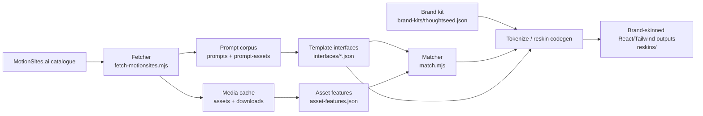
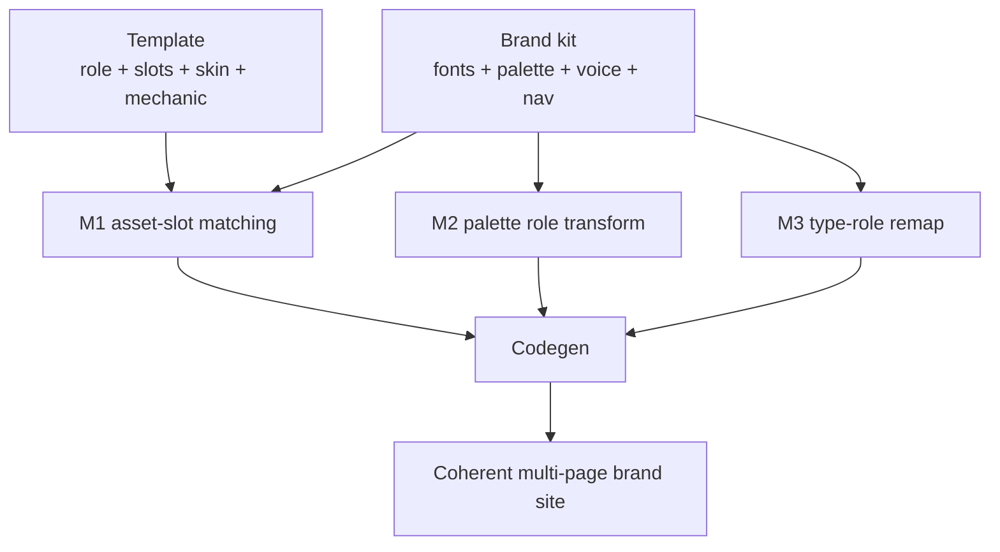

<div align="center">


<!-- readme-gen:start:badges -->


<!-- readme-gen:end:badges -->

<!-- readme-gen:start:tech-stack -->
<p>
  
</p>
<!-- readme-gen:end:tech-stack -->

</div>

Most prompt archives stop at a folder of text. **motionsites-skills** turns the MotionSites template catalogue into a structured, asset-aware corpus with scripts for harvesting, organizing, feature-extracting, matching, and reskinning templates into coherent brand systems.

> Prompt text and media are sourced from [MotionSites.ai](https://motionsites.ai). This repository is a personal archive and working set; respect MotionSites' terms for any reuse.


## Highlights

<table>
<tr>
<td width="50%" valign="top">

### Corpus with structure

265 prompt specs are normalized into `prompts/`, `prompt-assets/`, `prompts-index.tsv`, and corpus-level statistics.

</td>
<td width="50%" valign="top">

### Interface extraction

265/265 templates have machine-readable interfaces covering roles, slots, skin surfaces, mechanics, and reskin notes.

</td>
</tr>
<tr>
<td width="50%" valign="top">

### Asset-aware matching

Media is classified by type, aspect, duration, alpha, and CIELAB color so template slots can be matched against a reusable asset pool.

</td>
<td width="50%" valign="top">

### Brand-skin codegen

Tokenization and reskin scripts preserve structure and motion while remapping fonts, palette roles, copy, and optional asset bindings.

</td>
</tr>
</table>

## Quick Start

Requires **Node 18+** and **ffmpeg**. No package install is required for the committed scripts.

```bash
git clone https://github.com/Sheshiyer/motionsites-skills.git
cd motionsites-skills

node scripts/fetch-motionsites.mjs --dry-run
node scripts/organize-assets.mjs --dry-run
node scripts/match.mjs luxury-botanical --cohesion
```

For the full fetcher flag list and token notes, see [`scripts/README.md`](scripts/README.md).

## Corpus at a Glance

| Signal | Value |
|:--|--:|
| Prompt specs | 265 |
| Prompt text files | 265 |
| Prompt metadata files | 265 |
| Template interface files | 265 core interfaces / 269 JSON files total |
| Organized asset templates | 225 |
| Media assets in feature index | 624 |
| Templates with missing/private/dead assets | 22 |

## Core Workflows

| Goal | Command | Output |
|:--|:--|:--|
| Sync catalogue and media | `node scripts/fetch-motionsites.mjs` | `prompts-with-text.json`, `catalog-current.json`, prompt files, download manifests |
| Organize downloaded media | `node scripts/organize-assets.mjs` | `assets/<template>/...`, `asset-index.json`, `missing-assets-report.json` |
| Extract media features | `node scripts/extract-asset-features.mjs --concurrency=8` | `asset-features.json` |
| Match slots to assets | `node scripts/match.mjs luxury-botanical --cohesion` | ranked image/video picks per interface slot |
| Reskin single-file prompt specs | `node scripts/tokenize.mjs luxury-botanical brand-kits/thoughtseed.json --bind` | brand-tokenized HTML in `reskins/` |
| Reskin Tailwind `@theme` projects | `node scripts/reskin-theme.mjs <srcDir> brand-kits/thoughtseed.json` | updated `index.css` + `App.tsx` with `.bak` restore files |


## Architecture

<!-- readme-gen:start:architecture -->

<!-- readme-gen:end:architecture -->

## Project Structure

<!-- readme-gen:start:tree -->
```text
motionsites-skills
├── README.md                         # Project landing page
├── SKILL-SPEC.md                     # Brand-skin composer model, phases, and status
├── brand-kits/
│   └── thoughtseed.json              # Reference brand skin
├── interfaces/                       # Template role/slot/skin/mechanic contracts
├── prompt-assets/                    # Per-template metadata
├── prompts/                          # One prompt spec per MotionSites template
├── reskins/                          # Generated/demo reskin outputs and assembler reference
├── scripts/                          # Fetch, organize, feature extraction, matching, reskinning
├── asset-features.json               # Media feature vectors for matching
├── asset-index.json                  # Organized asset map by template
├── prompts-with-text.json            # Canonical corpus export
└── prompts-index.tsv                 # Flat searchable corpus index
```
<!-- readme-gen:end:tree -->

## The Brand-Skin Model

`SKILL-SPEC.md` defines the core invariant: a landing page is atomic. The reusable value is the template's structure, motion, and composition; the skin is what moves.



The v1 pipeline is documented as built through interface extraction, asset features, matching, reskin codegen, and a reference site assembler.

## Project Health

<!-- readme-gen:start:health -->
| Category | Status | Score |
|:--|:--:|--:|
| Corpus coverage | ████████████████████ | 100% |
| Asset indexing | █████████████████░░░ | 85% |
| Documentation | ████████████████░░░░ | 80% |
| Type safety | ████░░░░░░░░░░░░░░░░ | 20% |
| Tests | ░░░░░░░░░░░░░░░░░░░░ | 0% |
| CI/CD | ░░░░░░░░░░░░░░░░░░░░ | 0% |

> **Overall: 48%** — strong corpus and pipeline documentation, with testing, CI, and formal packaging still open.
<!-- readme-gen:end:health -->

## Responsible Use

Media caches and account-sensitive exports are intentionally excluded through `.gitignore`. Fetching paid prompt text requires a fresh MotionSites access token in a local `.env`; free prompt metadata and media fetches do not require committing secrets.

No license file is currently present, so treat this as an unpublished personal working set unless a license is added later.

<div align="center">

<!-- readme-gen:start:footer -->


**Built with care by [contributors](https://github.com/Sheshiyer/motionsites-skills/graphs/contributors).**
<!-- readme-gen:end:footer -->

</div>
